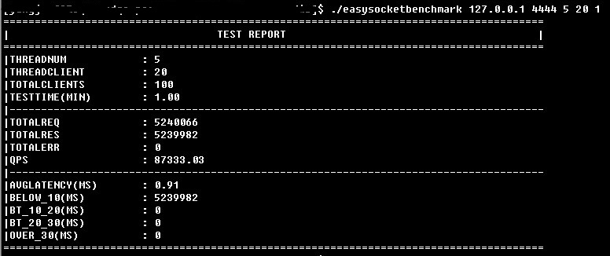

redisbasedsocketbenchmark
===================

高性能socket性能测试工具/框架，做socket性能测试工具的终结者。满足一般性能测试、延迟测试、最大连接数测试、吞吐量测试、压力测试、长时间稳定性测试、内存泄漏测试等场景。

### 简介:
* 基于redis事件库开发，one epoll per thread模型，超高性能。    
* 框架默认支持http性能测试，可轻松扩展到支持socket/rpc/http/redis/sqls等所有基于socket的性能测试。为socket性能测试提供通用解决方案。
* 支持随机请求、支持配置客户端个数、支持压力山大&固定qps模式、支持socket长短连接等配置。
* 支持qps、延迟、最大连接数等统计。
* 支持测试报告邮件自动发送。
* 支持轻松扩展。
* 基础demo开发完毕，完整功能持续开发中,敬请期待。

### 编译：     
./build.sh     

### 使用:
* 支持灵活命令行参数配置，运行如下命令启动性能测试:    
     

### 结果：     
* 性能指标统计完备，测试结果如下:    
     

